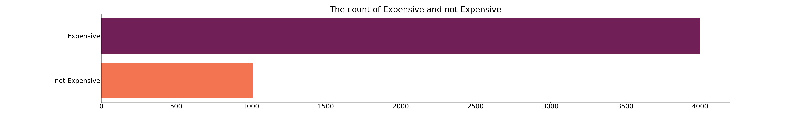
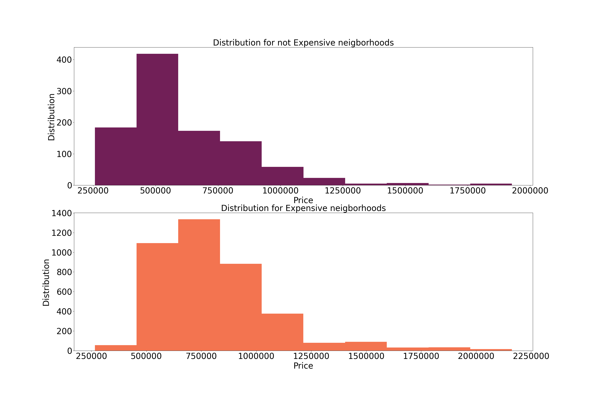
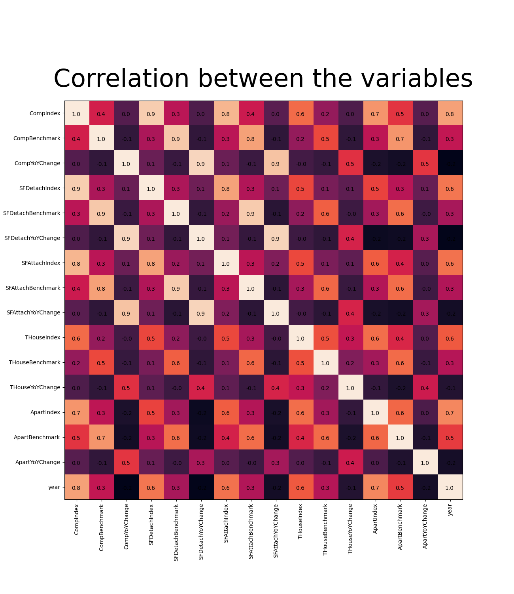

<p align="center">
  
</p>

Data science has had a huge effect on realstate industry. In this project i will work with toronto realstate data from 2015 to 2021. This project focuses on data analysis and provides a step-by-step explanation.
# Data analysis for realstate data in toronto from 2015 to 2021
# Table of content 
1. [Project overview](#project-overview)
2. [EDA steps](#eda-steps)
3. [Data collection](#data-collection)
4. [Data cleaning](#data-cleaning)
5. [Plotting data](#plotting-data)
6. [Distributions and analysis](#distributions-and-analysis)


## Project overview
### Project Summary from Kaggle:
[page link](https://www.kaggle.com/datasets/alankmwong/toronto-home-price-index)
#### Toronto Home Price Index
This Dataset contains in CSV format the monthly housing price information as published by the Toronto Regional Real Estate Board (TRREB) and Canadian Real Estate Association (CREA) as made public via their website and is based on the MLS Home Price Index.\
[https://trreb.ca/index.php/market-news/mls-home-price-index](https://trreb.ca/index.php/market-news/mls-home-price-index)
#### Content
Location - Neighbourhood in the Greater Toronto Area/
Comp - "Comp" stands for composite and takes into account the various types of housing into a single value.\
SFDetach - "SFDetach" stands for Single Family Detached Home, or commonly referred to as houses\
SFAttach - "SFAttach" stands for Single Family Attached Home\
THouse - "THouse" stands for Townhouses\
Apart - "Apart" is the abbreviation for Apartments or Condominuims\
All prices mentioned under "Benchmark" columns are depicted in Canadian Dollars\
All YoY Changes are in context of "Percentages"

## EDA steps
In this simple example i perform 3 steps for EDA:
* Data Collection
* Data Cleaning
* Plotting data

First of all, let's import required libraries and colorplates:
```
import pandas as pd
import numpy as np
import matplotlib.pyplot as plt
import seaborn as sns
from sklearn.linear_model import LinearRegression
from sklearn.metrics import r2_score

Color1 = sns.color_palette('rocket_r',71)
Color2 = sns.color_palette('rocket',10)
```

## Data collection
In this part, i imported the data using pandas dataframe and then converted it to a Dateframe. The output shows that everything was imported correctly.
```
    data = pd.read_csv('MLS.csv')
    df = pd.DataFrame(data)
    df.head(5)
```
output:
```
            Location  CompIndex  ...  ApartYoYChange        Date
0  Adjala-Tosorontio      143.7  ...             NaN  2015-07-01
1  Adjala-Tosorontio      140.8  ...             NaN  2015-08-01
2  Adjala-Tosorontio      142.7  ...             NaN  2015-09-01
3  Adjala-Tosorontio      138.4  ...             NaN  2015-10-01
4  Adjala-Tosorontio      145.4  ...             NaN  2015-11-01

[5 rows x 17 columns]
```
## Data cleaning
In the data cleaning process i deleted the duplicates and null records, replaced some nulls and created two column named year and month. I decided to drop Date column and use the year and month for easier analysis.

```
def data_clean(df):
    df.drop_duplicates(inplace=True)
    ColumnsNames = df.columns.values

    # drop na based on 'CompIndex'
    if df['CompIndex'].isnull().sum() >0:
        df.dropna(subset=['CompIndex'],inplace=True)

    #check if all price columns are float
    for c in ColumnsNames:
        if 'Location' not in str(c) and 'Date' not in str(c) :
            df[c].fillna(df[c].mean(),inplace=True)  # fill null with zeroes
            if df[c].dtype != 'float64':
                df[c].apply(pd.to_numeric)

    # check other nulls
    nulls = df.isnull().sum()
    if nulls.max() == 0:
        print('Bravoo, there are no nulls')

    #create a year coloumn
    df['Date'].apply(pd.to_datetime)
    df['year'] = pd.DatetimeIndex(df['Date']).year
    df['month'] = pd.DatetimeIndex(df['Date']).month
    # delete unwanted variables (Date)
    df.drop(columns='Date',inplace=True)
    # now we are ready for some analysis
    return df
```
After cleaning, this is what this dataset looks like:
```
# head
df.head(10)
```

```
# describe
df.describe()
```


## Plotting data
plotting data is a tool for understanding the data and finding patterns. In this project we use several charts.
### horizental bar chart
One of the most important features in our data is location of the property, so i draw a horizontal bar chart that shows locations from most expensive to the least expensive
```
def plot_price_nei(df):
    PlotYear = '2021'
    PlotYear = pd.to_numeric(PlotYear)
    dfTemp = df.where(df['year']==PlotYear).dropna()
    dfTemp = dfTemp.groupby(by = 'Location',as_index=False).mean()
    dfTemp.sort_values('CompBenchmark', inplace=True,ascending=True)
    fig , ax = plt.subplots(1)
    Bars = ax.barh(dfTemp['Location'],dfTemp['CompBenchmark'] ,color = Color1)
    ax.set_title('avarage price for each neighbourhood in ' 
                + str(PlotYear ),fontsize = 50)
    plt.yticks(fontsize = 35)
    plt.bar_label(Bars,fontsize = 35,fmt = '%d')
    fig.set_size_inches(50,70)
    fig.savefig('fig1.png')

```


### Line chart
The dataset contains data from 2015 to 2016 and i was interested to see the trend of pricing in different locations. the code and plots are for the location Ajax. I was also interested in estimating a value for 2022 using linear regression.
```
def plot_price_change(df):
    Location = 'Ajax'
    dfTemp = df.where(df['Location']==Location).dropna()
    dfTemp = dfTemp.groupby(by = 'year',as_index=False).mean()
    dfTemp.sort_values('year', inplace=True,ascending=True)

    # without regresion ---------------
    fig , ax = plt.subplots(1)
    ax.plot(dfTemp['year'],dfTemp['CompBenchmark'] ,color = Color2[5])
    ax.set_title('price change in ' + Location + ' over the years')
    fig.savefig('line1.png')
    
    # with regresion -------------------
    dfTemp.drop(columns = ['CompIndex',
       'CompYoYChange', 'SFDetachIndex', 'SFDetachBenchmark',
       'SFDetachYoYChange', 'SFAttachIndex', 'SFAttachBenchmark',
       'SFAttachYoYChange', 'THouseIndex', 'THouseBenchmark',
       'THouseYoYChange', 'ApartIndex', 'ApartBenchmark',
       'ApartYoYChange'] ,inplace = True)
    #create a dictionary for the column 'year'
    NormalDict = {}
    Ind = 0

    for y in dfTemp['year'].unique():
        NormalDict[y] = Ind
        Ind += 1
    
    NormalDict['2022'] = 7
    NormalDict['2023'] = 8

    # run regression model
    X = dfTemp['year'].map(NormalDict).values.reshape(-1, 1)
    y = dfTemp['CompBenchmark'].values.reshape(-1, 1)
    X_train = X
    y_train = y
    X_test = X[5:]
    y_test = y[5:]
    reg = LinearRegression()
    reg.fit(X_train,y_train)
    y_predict = reg.predict(X_test.reshape(-1, 1))
    R2score = r2_score(y_test,y_predict)
    year_p = '2022'
    new_x = np.array([NormalDict[year_p]])
    new_x = new_x.reshape(-1,1)
    new_y =reg.predict(new_x)
    new_x_index = list(NormalDict.values()).index(new_x[0][0])
    new_x = list(NormalDict.keys())[new_x_index]
    new_df = pd.DataFrame({'year': new_x,'CompBenchmark':new_y[0]})

    # plotting with new data
    fig , ax = plt.subplots(1)
    dfTemp = pd.concat([dfTemp,new_df])
    ax.plot(dfTemp['year'],dfTemp['CompBenchmark'] ,color = Color2[2])
    ax.set_title('price change in ' + Location + ' over the years')
    fig.savefig('linearReg.png')
```


r2 score for linear regression :0.577776808271866\
As shown by r2 score and the figure above it's not a good estimate.

### grouped bar chart
There are four types of housing in the dataset and i plotted them for different locations to see the demographic diffrences. Since it would create rather large chart, i did it 5 location at the time.
```
    PlotYear = '2020'
    PlotYear = pd.to_numeric(PlotYear)
    dfTemp = df.where(df['year']==PlotYear).dropna()
    dfTemp = dfTemp.groupby(by = 'Location',as_index=False).mean()
    dfTemp = dfTemp.iloc[0:5,:]
    dfTemp.drop(columns = ['CompIndex','CompYoYChange',
                'CompBenchmark', 'SFDetachIndex','SFDetachYoYChange', 
                'SFAttachIndex', 'SFAttachYoYChange', 'THouseIndex', 
                'THouseYoYChange', 'ApartIndex', 'ApartYoYChange',
                'year'] ,inplace = True)
    x = np.arange(len(dfTemp['Location']))
    width = .2
    fig , ax = plt.subplots(1)
    rect1 = ax.bar(x-.3,dfTemp['SFDetachBenchmark'],
                    width,label = 'SF Detached home',color = Color1[10])
    rect2 = ax.bar(x-.1,dfTemp['SFAttachBenchmark'],
                    width,label = 'SF Attached home',color = Color1[20])
    rect3 = ax.bar(x+.1,dfTemp['THouseBenchmark'],
                    width,label = 'T House',color = Color1[30])
    rect4 = ax.bar(x+.3,dfTemp['ApartBenchmark'],
                    width,label = 'Apartment',color = Color1[40])
    ax.set_ylabel('Price')
    plt.xlabel('Location')
    ax.set_title('price for different housing types')
    ax.set_xticks(x, dfTemp['Location'])
    ax.ticklabel_format( axis='y',style = 'plain')
    ax.legend()
    ax.bar_label(rect1, padding=3 , fmt = '%d')
    ax.bar_label(rect2, padding=3)
    ax.bar_label(rect3, padding=3)
    ax.bar_label(rect4, padding=3)
    fig.set_size_inches(22,8)
    fig.savefig('groupBar.png')
    
```


## Distributions and analysis
for didtribution analysis it would be useful to have a target variable so i added on named marjan_index.
### Adding data
In this part i will add some boolean data that i've created. i'll call it marjan_index and shows the affordability of the location.
```
def add_data(df):
    marjan_index = []
    n = 0

    for i in df['Location']:
        pr = df.iloc[[n]]['CompBenchmark']
        if pr[n] >= 500000 :
            r = np.random.choice(2,1,p=[.11,.89])
        else:
            r = np.random.choice(2,1,p=[.85,.15])
        marjan_index.append(r[0])
        n+=1

    df.loc[:,'marjan_index'] = marjan_index
    pd.DataFrame.to_csv(df,'newData.csv')

```

### loading the new data and plotting counts
For this plot I splitted the dataset into two sub dataframes for expensive and not expensive locations. Then I plotted their counts.
```
  def plot_count(df):
    # split into two dataset
    z = df[(df['marjan_index']==0)]
    o = df[(df['marjan_index']==1)]
    fig , ax = plt.subplots(1)
    Bars = ax.barh(['not Expensive','Expensive'],[len(z),len(o)],
                    color=[Color1[20],Color1[50]])
    ax.set_title('The count of Expensive and not Expensive',fontsize = 50)
    plt.yticks(fontsize = 40)
    plt.xticks(fontsize = 40)
    fig.set_size_inches(70,10)
    fig.savefig('barh2.png')
    
```

### plotting distribution
For the two dataframes expensive and not expensive, i created the distribution plot using histogram.
```
def plot_distribution(df):
    notExpensive = df[(df['marjan_index']==0)]
    expensive = df[(df['marjan_index']==1)]
    fig , ax = plt.subplots(2,1)
    ax[0].hist(notExpensive['CompBenchmark'],color = Color1[50])
    ax[1].hist(expensive['CompBenchmark'],color = Color1[20])
    ax[0].set_title('Distribution for not Expensive neigborhoods',fontsize = 30)
    ax[1].set_title('Distribution for Expensive neigborhoods',fontsize = 30)
    ax[0].set_xlabel('Price',fontsize = 30)
    ax[1].set_xlabel('Price',fontsize = 30)  
    ax[0].set_ylabel('Distribution',fontsize = 30)
    ax[1].set_ylabel('Distribution',fontsize = 30)
    ax[0].tick_params(axis='both', labelsize=30,)
    ax[1].tick_params(axis='both', labelsize=30)
    ax[0].ticklabel_format( axis='x',style = 'plain')
    ax[1].ticklabel_format( axis='x',style = 'plain')
    fig.set_size_inches(30,20)
    fig.savefig('hist.png')
    
```

### Correlation matrix
It's always a good idea to draw the correlation matrix to analyse the data.
```
def plot_co_matrix(df):
    Correlation = df.corr()
    ToDrop = ['Unnamed: 0','marjan_index']
    Correlation.drop(columns = ToDrop,inplace=True)
    Correlation.drop(ToDrop,axis=0 ,inplace=True)
    MatrixCols = Correlation.columns.tolist()
    fig , ax = plt.subplots()
    ax.imshow(Correlation,cmap='rocket')
    ax.set_xticks(np.arange(len(MatrixCols)),labels = MatrixCols,
                rotation='vertical')
    ax.set_yticks(np.arange(len(MatrixCols)),labels = MatrixCols)

    for i in range(len(MatrixCols)):
        for j in range(len(MatrixCols)):
            ax.text(j-.2,i+.12,np.around(Correlation.iloc[i,j],decimals = 1))

    ax.set_title('Correlation between the variables',fontsize = 45,pad = 25)
    fig.set_size_inches(13,15)
    fig.savefig('heatmap.png')
```

## The end
I hope this simple demostration shows parts of my EDA skills which are far beyond this projects.
