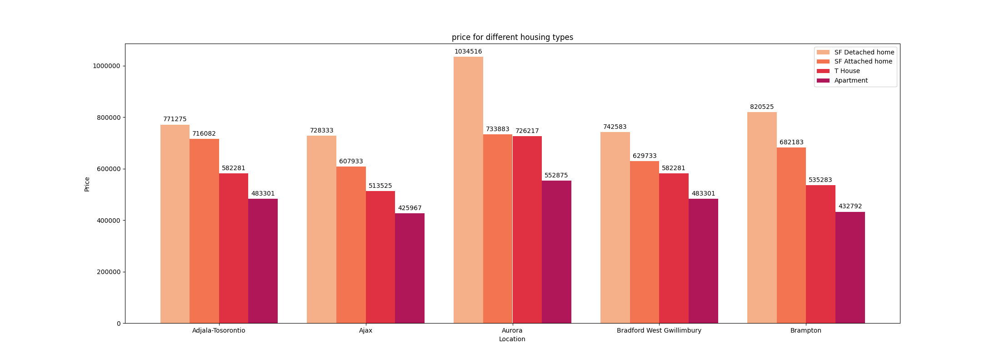

Data science has had a huge effect on realstate industry. In this project i will work with toronto realstate data from 2015 to 2021. This project focuses on data analysis and provides a step-by-step explanation.
# Data analysis for realstate data in toronto from 2015 to 2021
# Table of content 
1. [Project overview](#project-overview)
2. [EDA steps](#eda-steps)
3. [Data collection](#data-collection)
4. [Data cleaning](#data-cleaning)
5. [Plotting data](#Plotting-data)


## Project overview
### Project Summary from Kaggle:
[page link](https://www.kaggle.com/datasets/alankmwong/toronto-home-price-index)
#### Toronto Home Price Index
This Dataset contains in CSV format the monthly housing price information as published by the Toronto Regional Real Estate Board (TRREB) and Canadian Real Estate Association (CREA) as made public via their website and is based on the MLS Home Price Index.\
[https://trreb.ca/index.php/market-news/mls-home-price-index](https://trreb.ca/index.php/market-news/mls-home-price-index)
#### Content
Location - Neighbourhood in the Greater Toronto Area/
Comp - "Comp" stands for composite and takes into account the various types of housing into a single value.\
SFDetach - "SFDetach" stands for Single Family Detached Home, or commonly referred to as houses\
SFAttach - "SFAttach" stands for Single Family Attached Home\
THouse - "THouse" stands for Townhouses\
Apart - "Apart" is the abbreviation for Apartments or Condominuims\
All prices mentioned under "Benchmark" columns are depicted in Canadian Dollars\
All YoY Changes are in context of "Percentages"

## EDA steps

* Data Collection
* Data Cleaning
* Plotting data


## Data collection
In this part, i imported the data using pandas dataframe and then converted it to a Dateframe. The output shows that everything was imported correctly.
```
    data = pd.read_csv('MLS.csv')
    df = pd.DataFrame(data)
    df.head(5)
```
output:
```
            Location  CompIndex  ...  ApartYoYChange        Date
0  Adjala-Tosorontio      143.7  ...             NaN  2015-07-01
1  Adjala-Tosorontio      140.8  ...             NaN  2015-08-01
2  Adjala-Tosorontio      142.7  ...             NaN  2015-09-01
3  Adjala-Tosorontio      138.4  ...             NaN  2015-10-01
4  Adjala-Tosorontio      145.4  ...             NaN  2015-11-01

[5 rows x 17 columns]
```
## Data cleaning
In the data cleaning process i deleted the duplicates and null records, replaced some nulls and created a column named year. I decided to drop Date column and use the year and month for easier analysis.

```
    df.drop_duplicates(inplace=True)
    cols = df.columns.values
    # drop na based on 'CompIndex'
    if df['CompIndex'].isnull().sum() >0:
        df.dropna(subset=['CompIndex'],inplace=True)

    #check if all price columns are float
    for c in cols:
        if 'Location' not in str(c) and 'Date' not in str(c) :
            df[c].fillna(df[c].mean(),inplace=True)  # fill null with zeroes
            if df[c].dtype != 'float64':
                df[c].apply(pd.to_numeric)

    # check other nulls
    nulls = df.isnull().sum()
    if nulls.max() == 0:
        print('Bravoo, there are no nulls')

    #create a year coloumn
    df['Date'].apply(pd.to_datetime)
    df['year'] = pd.DatetimeIndex(df['Date']).year
    df['month'] = pd.DatetimeIndex(df['Date']).month
    # delete unwanted variables (Date)
    df.drop(columns='Date',inplace=True)
    # now we are ready for some analysis
```
After cleaning, this is what this dataset looks like:
```
# head
df.head(10)
```

```
# describe
df.describe()
```


## Plotting data
### horizental bar chart

```
    plotyear = '2021'
    plotyear = pd.to_numeric(plotyear)
    df_temp = df.where(df['year']==plotyear).dropna()
    df_temp = df_temp.groupby(by = 'Location',as_index=False).mean()
    df_temp.sort_values('CompBenchmark', inplace=True,ascending=True)

    fig , ax = plt.subplots(1)
    bars = ax.barh(df_temp['Location'],df_temp['CompBenchmark'] ,color = color1)
    ax.set_title('avarage price for each neighbourhood in ' + str(plotyear ),fontsize = 50)
    plt.yticks(fontsize = 35)
    plt.bar_label(bars,fontsize = 35,fmt = '%d')
    fig.set_size_inches(50,70)
    fig.savefig('fig1.png')
    

```


### Line chart
```
    neg = 'Ajax'
    df_temp = df.where(df['Location']==neg).dropna()
    df_temp = df_temp.groupby(by = 'year',as_index=False).mean()
    df_temp.sort_values('year', inplace=True,ascending=True)

    # without regresion ---------------
    fig , ax = plt.subplots(1)
    ax.plot(df_temp['year'],df_temp['CompBenchmark'] ,color = color2[5])
    ax.set_title('price change in ' + neg + ' over the years')
    fig.savefig('line1.png')
    
    # with regresion -------------------
    df_temp.drop(columns = ['Unnamed: 0','CompIndex',
       'CompYoYChange', 'SFDetachIndex', 'SFDetachBenchmark',
       'SFDetachYoYChange', 'SFAttachIndex', 'SFAttachBenchmark',
       'SFAttachYoYChange', 'THouseIndex', 'THouseBenchmark',
       'THouseYoYChange', 'ApartIndex', 'ApartBenchmark',
       'ApartYoYChange'] ,inplace = True)
    #create a dictionary for the column 'year'
    NormalDict = {}
    ind = 0
    for y in df_temp['year'].unique():
        NormalDict[y] = ind
        ind += 1
    NormalDict['2022'] = 7
    NormalDict['2023'] = 8

    # run regression model
    
    X = df_temp['year'].map(NormalDict).values.reshape(-1, 1)
    y = df_temp['CompBenchmark'].values.reshape(-1, 1)
    X_train = X
    y_train = y
    X_test = X[5:]
    y_test = y[5:]


    reg = LinearRegression()
    reg.fit(X_train,y_train)
    y_predict = reg.predict(X_test.reshape(-1, 1))
    R2score = r2_score(y_test,y_predict)
    print(R2score)
    year_p = '2022'
    new_x = np.array([NormalDict[year_p]])
    new_x = new_x.reshape(-1,1)
    new_y =reg.predict(new_x)
    new_x_index = list(NormalDict.values()).index(new_x[0][0])
    new_x = list(NormalDict.keys())[new_x_index]
    new_df = pd.DataFrame({'year': new_x,'CompBenchmark':new_y[0]})

    # plotting with new data
    fig , ax = plt.subplots(1)
    df_temp = pd.concat([df_temp,new_df])
    ax.plot(df_temp['year'],df_temp['CompBenchmark'] ,color = color2[2])
    ax.set_title('price change in ' + neg + ' over the years')
    # ax.plot(new_x,new_Y,c=color3[0])
    fig.savefig('linearReg.png')
```


r2 score for linear regression :0.577776808271866\
As shown by r2 score and the figure above it's not a good estimate.
### grouped bar chart
```
    plotyear = '2020'
    plotyear = pd.to_numeric(plotyear)
    df_temp = df.where(df['year']==plotyear).dropna()
    df_temp = df_temp.groupby(by = 'Location',as_index=False).mean()
    df_temp = df_temp.iloc[0:5,:]
    df_temp.drop(columns = ['Unnamed: 0','CompIndex','CompYoYChange','CompBenchmark', 'SFDetachIndex', 
       'SFDetachYoYChange', 'SFAttachIndex', 'SFAttachYoYChange', 'THouseIndex', 
       'THouseYoYChange', 'ApartIndex', 'ApartYoYChange','year'] ,inplace = True)

    x = np.arange(len(df_temp['Location']))
    width = .2
    fig , ax = plt.subplots(1)
    rect1 = ax.bar(x-.3,df_temp['SFDetachBenchmark'],width,label = 'SF Detached home',color = color1[10])
    rect2 = ax.bar(x-.1,df_temp['SFAttachBenchmark'],width,label = 'SF Attached home',color = color1[20])
    rect3 = ax.bar(x+.1,df_temp['THouseBenchmark'],width,label = 'T House',color = color1[30])
    rect4 = ax.bar(x+.3,df_temp['ApartBenchmark'],width,label = 'Apartment',color = color1[40])

    ax.set_ylabel('Price')
    plt.xlabel('Location')
    ax.set_title('price for different housing types')
    ax.set_xticks(x, df_temp['Location'])
    ax.ticklabel_format( axis='y',style = 'plain')
    ax.legend()

    ax.bar_label(rect1, padding=3 , fmt = '%d')
    ax.bar_label(rect2, padding=3)
    ax.bar_label(rect3, padding=3)
    ax.bar_label(rect4, padding=3)

    fig.set_size_inches(22,8)
    fig.savefig('groupBar.png')
```



Target distribution \
## Adding data
In this part i will add some boolean data that i've created. i'll call it marjan_index
```
    marjan_index = []
    for i in df['Location']:
        r = np.random.choice(2,1)
        marjan_index.append(r[0])
        
    df.loc[:,'marjan_index'] = marjan_index
    pd.DataFrame.to_csv(df,'newData.csv')


```


```
    data = pd.read_csv('newData.csv')
    df = pd.DataFrame(data)
    
```
## some analysis

