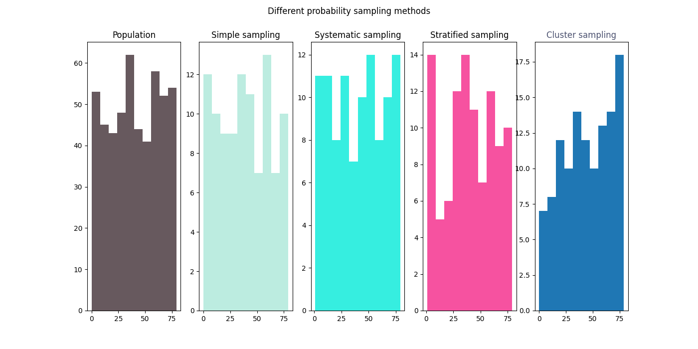

# Exploring different sampling methods
## The code
This code has several parts:
### Importing libraries
```
import numpy as np
import pandas as pd
import matplotlib.pyplot as plt
```
### Create data function
```
def create_data(PopulationNumber):
    # create dataset
    Id = np.arange(PopulationNumber)
    EyeColors = ['black','brown','blue','green']
    Eye = np.random.choice(EyeColors,PopulationNumber)
    Age = np.random.randint(80,size = PopulationNumber)
    Happy = np.random.choice(['yes','no'],PopulationNumber)
    data = {'Id':Id,'Eye color':Eye,'Age':Age,'Happy':Happy}
    population = pd.DataFrame(data)
    return population
```
### Simple random sampling function
```
def simple_random_sampling(population,PopulationNumber,SampleNumber):
    Id = np.arange(PopulationNumber)
    IdSample = np.random.choice(Id,SampleNumber,replace=False)   # Select random ids
    Sample = population.iloc[IdSample]
    return Sample

```
### Stratified sampling function
```
def stratified_sampling(population,PopulationNumber,SampleNumber):
    Factor = 'Eye'
    ClusterNumber = len(population['Eye color'].unique())
    Ids = []
    for iter in range(ClusterNumber):
        EyeColor = population['Eye color'].unique()[iter]
        Group = population[population['Eye color']==EyeColor]
        Id = np.arange(len(Group))
        IdSample = np.random.choice(Id,int(SampleNumber/ClusterNumber),replace=False)
        Ids = Ids + IdSample.tolist()
    Sample = population.iloc[Ids]
    return Sample

```
### Cluster sampling function
```    
def cluster_sampling(population,PopulationNumber):
    Factor = 'Eye'
    ClusterNumber = len(population['Eye color'].unique())
    SampleCluster = np.random.randint(ClusterNumber,size = 1)
    for iter in range(ClusterNumber):
        if iter == SampleCluster:
            EyeColor = population['Eye color'].unique()[iter]
            Sample = population[population['Eye color']==EyeColor]
    return Sample
```
### Systematic random sampling function
``` 
def systematic_random_sampling(population,PopulationNumber,SampleNumber,Interval):
    Upper = PopulationNumber-(SampleNumber*Interval)
    First = np.random.randint(0,Upper,size = 1)
    IdSample = []
    for iter in range(SampleNumber):
        IdSample.append(First[0])
        First += Interval
    Sample = population.iloc[IdSample]
    return Sample


```
### plotting function
``` 
def plotting(population,SampleSimple,SampleSystematic,SampleStratified,SampleCluster):
    # ploting
    fig , ax = plt.subplots(1,5)
    fig.suptitle('Different probability sampling methods')
    fig.set_size_inches(14,7)
    ax[0].hist(population['Age'],color = '#67595E')
    ax[0].set_title('Population')

    ax[1].hist(SampleSimple['Age'],color = '#BCECE0')
    ax[1].set_title('Simple sampling')

    ax[2].hist(SampleSystematic['Age'],color = '#36EEE0')
    ax[2].set_title('Systematic sampling')

    ax[3].hist(SampleStratified['Age'],color = '#F652A0')
    ax[3].set_title('Stratified sampling')

    ax[4].hist(SampleCluster['Age'])
    ax[4].set_title('Cluster sampling',color = '#4C5270')
    fig.savefig('sample.png')
    plt.show()
```
### Main function
``` 
def main():
    PopulationNumber = 500
    SampleNumber = int(PopulationNumber/5)
    population = create_data(PopulationNumber)
    SampleSimple = simple_random_sampling(population,PopulationNumber,SampleNumber)
    Interval = int(PopulationNumber/120)
    SampleSystematic = systematic_random_sampling(population,PopulationNumber,SampleNumber,Interval)
    SampleStratified = stratified_sampling(population,PopulationNumber,SampleNumber)
    SampleCluster = cluster_sampling(population,PopulationNumber)
    plotting(population,SampleSimple,SampleSystematic,SampleStratified,SampleCluster)

main()
```
## The result

